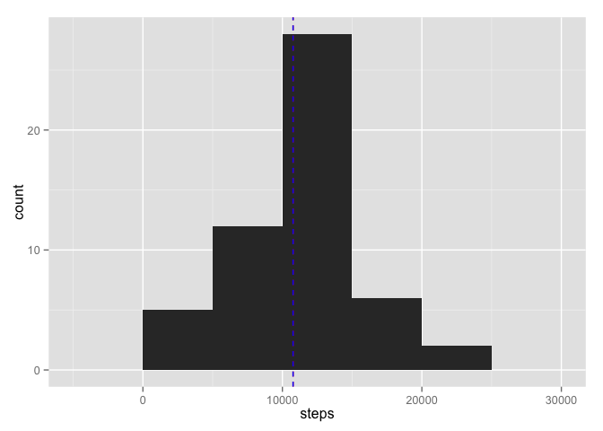
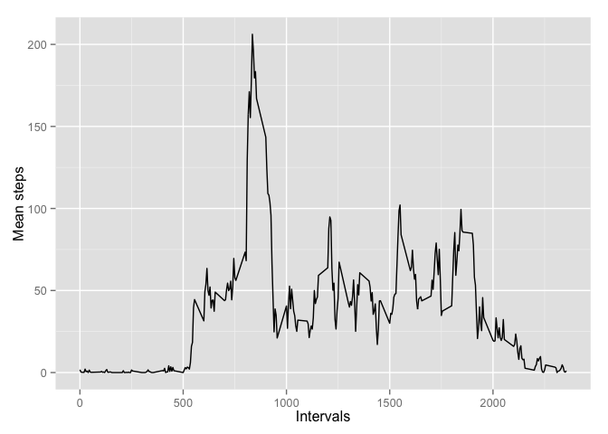
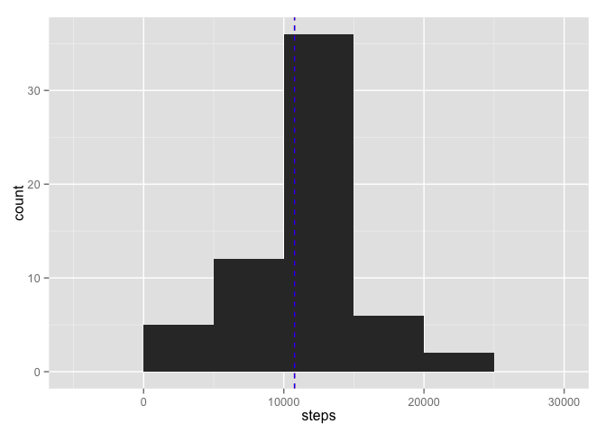
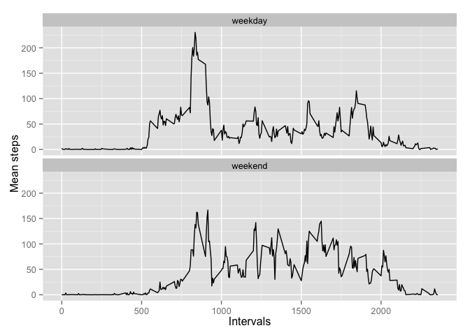

# Reproducible Research: Peer Assessment 1


## Loading and preprocessing the data

Loading libraries

```r
library(dplyr)
library(ggplot2)
```

Reading data

```r
data <- read.csv(unz("activity.zip", "activity.csv"), colClasses = c("numeric", "character", "numeric"))
head(data)
```

```
##   steps       date interval
## 1    NA 2012-10-01        0
## 2    NA 2012-10-01        5
## 3    NA 2012-10-01       10
## 4    NA 2012-10-01       15
## 5    NA 2012-10-01       20
## 6    NA 2012-10-01       25
```

## What is mean total number of steps taken per day?


```r
steps_by_date <-
  group_by(data, date) %>%
  summarise(
    steps = sum(steps, na.rm = TRUE)
  ) %>%
  filter(steps > 0)

steps_mean <- mean(steps_by_date$steps)
steps_median <- median(steps_by_date$steps)

ggplot(steps_by_date, aes(x = steps)) +
  geom_histogram(binwidth = 5000) +
  geom_vline(aes(xintercept = steps_mean), color = "red", linetype = "dashed") +
  geom_vline(aes(xintercept = steps_median), color = "blue", linetype = "dashed")
```

 

```r
steps_mean
```

```
## [1] 10766.19
```

```r
steps_median
```

```
## [1] 10765
```

## What is the average daily activity pattern?


```r
avg_steps_by_interval <-
  group_by(data, interval) %>%
  summarise(
    steps = mean(steps, na.rm = TRUE)
  )

ggplot(avg_steps_by_interval, aes(x = interval, y = steps)) +
  geom_line() +
  labs(x = "Intervals", y = "Mean steps")
```

 


## Imputing missing values

Total number of missing values in the dataset:

```r
nrow(filter(data, is.na(steps)))
```

```
## [1] 2304
```

New dataset that is equal to the original dataset but with the missing data filled in:

```r
steps_by_interval <- as.list(setNames(avg_steps_by_interval$steps, avg_steps_by_interval$interval))
new_data <- rowwise(data) %>%
  mutate(
    steps = ifelse(is.na(steps), steps_by_interval[[ as.character(interval) ]], steps)
  )

new_steps_by_date <-
  group_by(new_data, date) %>%
  summarise(
    steps = sum(steps, na.rm = TRUE)
  ) %>%
  filter(steps > 0)
```

```
## Warning: Grouping rowwise data frame strips rowwise nature
```

```r
new_steps_mean <- mean(new_steps_by_date$steps)
new_steps_median <- median(new_steps_by_date$steps)

ggplot(new_steps_by_date, aes(x = steps)) +
  geom_histogram(binwidth = 5000) +
  geom_vline(aes(xintercept = steps_mean), color = "red", linetype = "dashed") +
  geom_vline(aes(xintercept = steps_median), color = "blue", linetype = "dashed")
```

 

```r
new_steps_mean
```

```
## [1] 10766.19
```

```r
new_steps_median
```

```
## [1] 10766.19
```

## Are there differences in activity patterns between weekdays and weekends?

New factor variable in the dataset with two levels – “weekday” and “weekend”:

```r
new_data$day <- "weekday"
new_data[is.element(weekdays(as.Date(new_data$date)), c("Saturday", "Sunday")), ]$day <- "weekend"
new_data <- transform(new_data, day = factor(day))

new_avg_steps_by_interval <-
  group_by(new_data, interval, day) %>%
  summarise(
    steps = mean(steps, na.rm = TRUE)
  )

ggplot(new_avg_steps_by_interval, aes(x = interval, y = steps)) +
  geom_line() +
  facet_wrap( ~ day, ncol = 1) +
  labs(x = "Intervals", y = "Mean steps")
```

 
